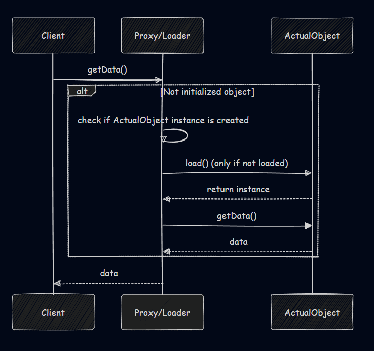
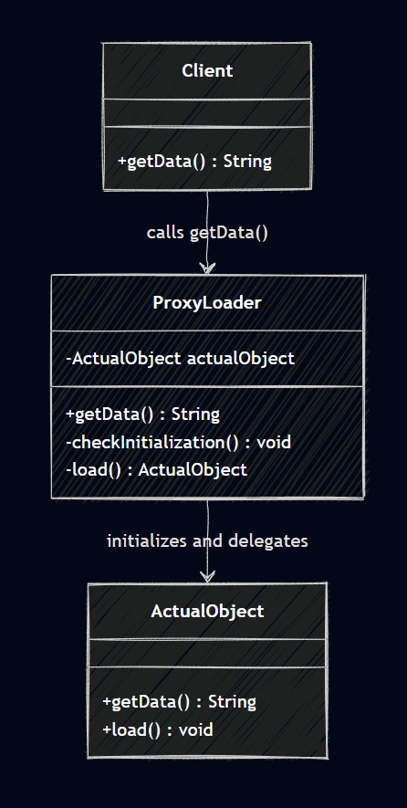

## Java Design Patterns: Architecture

---

# Lazy Loading
Lazy Loading (or Lazy Initialization) is a design pattern in Java where an object is instantiated only when it is first accessed, rather than at application startup. This approach defers resource-heavy initialization, reduces memory usage, and improves startup performance. It is commonly implemented using getters, proxies, or the Singleton pattern with lazy instantiation.

This sequence diagram shows how lazy loading works at runtime. The Client requests data from the Proxy/Loader, which checks whether the ActualObject has already been created. If it is not initialized, the Proxy/Loader loads and instantiates the ActualObject, then delegates the request to it. The ActualObject returns the data to the Proxy/Loader, which finally passes it back to the Client. This ensures the ActualObject is only created when first needed, optimizing resource usage and performance.

---

### ✅ Benefits and ⚠️ Tradeoffs
**Benefits:**
- Faster application startup
- Reduced memory footprint
- Efficient resource utilization

**Tradeoffs:**
- First access may be slower
- Increased code complexity
- Requires thread-safety mechanisms

---

### 🔑 Key Components
- **Object/Resource**: The expensive entity to be loaded
- **Proxy/Loader**: Manages initialization logic
- **Trigger (Access Point)**: Method call that initiates loading

---

### 🏗️ Architecture Layout
This UML diagram illustrates the Lazy Loading pattern where the Client requests data through the ProxyLoader. The ProxyLoader checks if the ActualObject has been initialized; if not, it loads and creates the instance before delegating the request. Once initialized, the ProxyLoader simply forwards subsequent calls to the ActualObject, ensuring that the resource is only created when needed, optimizing performance and memory usage.

---

### 📌 Use Cases
- Database connections
- Large configuration files
- Images/media in applications
- Singleton objects with heavy setup

---

### 🌟 Best Practices
- Ensure thread safety (e.g., double-checked locking)
- Apply only to expensive or rarely used objects
- Combine with caching for repeated access
- Keep implementation simple and maintainable

---
